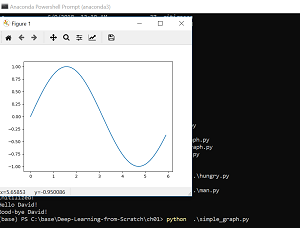

# Deep-Learning-from-Scratch
http://www.ituring.com.cn/book/1921

## license
http://www.opensource.org/licenses/MIT

## INSTALLATION
https://www.anaconda.com/distribution/  Python 3.7/NumPy/Matplotlib

Anaconda Navigator：管理工具包和环境的图形用户界面。
https://www.7-zip.org/                 

