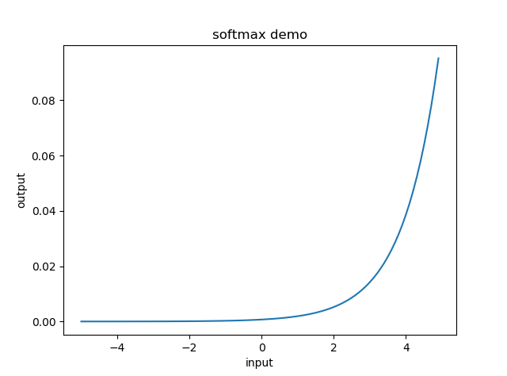

# Deep-Learning-from-Scratch
http://www.ituring.com.cn/book/1921

## license
http://www.opensource.org/licenses/MIT

## INSTALLATION
* https://www.anaconda.com/distribution/  Python 3.7/NumPy/Matplotlib
* 
* https://www.7-zip.org/                 

## ch02 Perceptron
* AND/NAND/OR gate 的实现: bias + w1*x1 + w2*x2
* XOR gate implemeted via multi-layered perceptron

## ch03 Neural Network
  神经网络中，每个node is called neuron
* activation function: 这里就是把node 细化成两部分，a. 前一层输出的加权和， b.激活函数 h(x)---->y
  * sigmoid function
  * 
  * step function
  * activation function must not be linear function，否者分层就没有意义了，因为多层线性函数可以用一层的线性函数表示
  * ReLU (Rectified linear unit) function
  * 
* 用线性代数的方式表示的话, 加权和A = XW + B ( X:prior layer,B:bias)
* 恒等函数与softmax函数： 
* 
* 由于softmax 函数不改变各个元素之间的大小关系，而神经元网络的识别结果就是选取最大的，所以输出层一般没有必要用softmax函数
* 学习与推理： 
* 学习： 用训练数据（学习数据）进行权重参数的学习
* 推理： 使用学习到的参数，对输入数据进行分类
* MNIST 手写数字图像集： de factor
* 