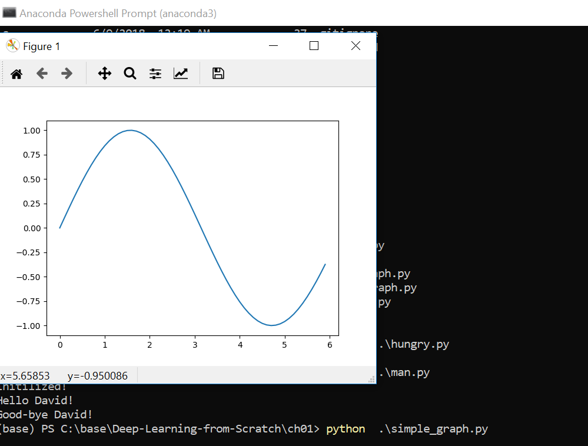
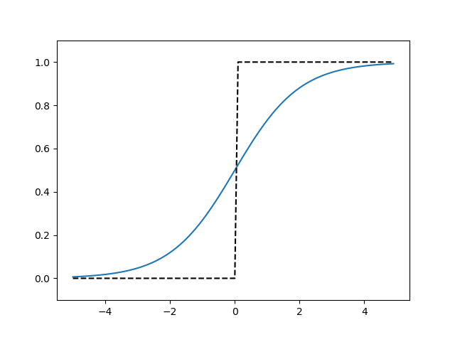

# Deep-Learning-from-Scratch
http://www.ituring.com.cn/book/1921

## license
http://www.opensource.org/licenses/MIT

## INSTALLATION
* https://www.anaconda.com/distribution/  Python 3.7/NumPy/Matplotlib
* 
* https://www.7-zip.org/                 

## ch02 Perceptron
* AND/NAND/OR gate can be implemented as: bias + w1*x1 + w2*x2
* XOR gate implemeted via multi-layered perceptron
   the process is quite funny, just similiar as in the class "digital electronic"

## ch03 Neural Network
  each node is called neuron
* activation function:  加权和 ---h(x)---->y
  * sigmoid function
  * 
  * step function
  * activation function must not be linear function
  * ReLU (Rectified linear unit) function
  * 
* expressed as Matrix, 加权和 A = XW + B ( X:prior layer,B:bias) 
* 
